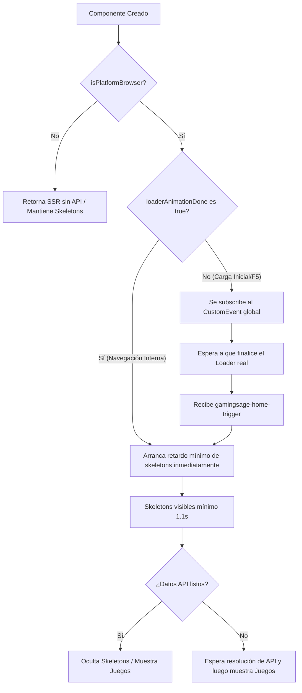

# Blueprint Arquitectónico: Sincronización Híbrida de Skeletons bajo Loaders Globales (Angular SSR)

Este documento detalla el patrón de sincronización diseñado y perfeccionado para la Landing Page de **GameSage SSR**. Este patrón garantiza una transición impecable entre la pantalla de carga global y los esqueletos de carga (*skeletons*), asegurando que:
1. En **Carga Inicial (F5 / Recarga)**: Los skeletons se muestran durante un retardo mínimo garantizado de **1.1 segundos** que empieza estrictamente *después* de que el loader global se desvanece por completo.
2. En **Navegación Interna**: Los skeletons se muestran de inmediato por el mismo periodo mínimo de **1.1 segundos** sin depender de ningún cargador global.
3. Se evitan por completo los parpadeos (*flickers*) causados por la hidratación de datos y la resolución prematura de animaciones de Angular.

---

## 1. El Problema Original: La Trampa de la Hidratación

En Angular SSR, el servidor genera el HTML y el navegador se encarga de "hidratar" los componentes para hacerlos interactivos. Al utilizar animaciones nativas de Angular para el desvanecimiento del loader global (`app-loading`):
* Durante la **fase de hidratación**, Angular analiza el DOM existente. Al intentar emparejar la directiva de animación `@leaveAnimation`, frecuentemente detecta que el elemento ya se encuentra en su estado inactivo o final y dispara el callback de animación finalizada `(@leaveAnimation.done)="onLoaderAnimationDone()"` de forma **prematura** (en los primeros ~200ms de carga).
* Si el disparador de skeletons de la página escucha ciegamente este callback, la cuenta atrás mínima de skeletons se inicia y finaliza en segundo plano *mientras el loader sigue tapando la pantalla*.
* **Consecuencia**: Cuando el loader de 2 segundos finalmente desaparece, los skeletons ya han expirado, mostrando los juegos de golpe y rompiendo la experiencia visual fluida.

---

## 2. La Solución: Arquitectura de Doble Ruta Activa

Para solucionar esto de forma robusta e infranqueable, dividimos la inicialización en dos escenarios lógicos independientes gobernados por el estado global de la UI:



### Escenario A: Carga Inicial (F5) con Loader Activo
1. `UiStateService.loaderAnimationDone` se inicializa en `false`.
2. El componente secundario se suscribe al evento nativo `gamingsage-home-trigger` en lugar de autolanzarse.
3. Para contrarrestar el disparo prematuro por hidratación en `AppComponent`, se aplica un **guardia de estado de carga**:
   ```typescript
   public onLoaderAnimationDone(): void {
     if (this.isLoading) {
       return; // Ignora disparos prematuros si el loader sigue activo en memoria
     }
     this.uiState.loaderAnimationDone.set(true);
     // Despacha el trigger al cabo de un instante de seguridad (100ms)
     setTimeout(() => {
       window.dispatchEvent(new CustomEvent('gamingsage-home-trigger'));
     }, 100);
   }
   ```
4. Al expirar el loader real, `isLoading` cambia a `false`, la animación de salida finaliza y esta vez el guardia permite emitir el `gamingsage-home-trigger`.
5. El componente hijo recibe el evento, activa `startMinimumSkeletonDelay()` y garantiza los 1.1s de skeletons visibles tras la salida del loader.

### Escenario B: Navegación Interna (Sin Loader)
1. `UiStateService.loaderAnimationDone` ya tiene valor `true` en el servicio global.
2. Al crearse el componente hijo, su constructor evalúa de forma inmediata:
   ```typescript
   if (this.uiState.loaderAnimationDone()) {
     this.startMinimumSkeletonDelay();
   }
   ```
3. Se evita añadir cualquier escuchador global del DOM y el flujo de skeletons transcurre de forma 100% independiente y fluida.

---

## 3. Guía de Implementación Paso a Paso (Blueprint Reutilizable)

Para aplicar este patrón exacto en **cualquier otra pantalla** (por ejemplo, Detalles de Producto, Búsqueda, etc.), sigue esta receta de 3 pasos:

### Paso 1: Configurar el Componente Padre (`AppComponent`)
Asegúrate de que `onLoaderAnimationDone()` tiene la protección contra hidratación prematura y emite el CustomEvent:

```typescript
// app.component.ts
public onLoaderAnimationDone(): void {
  if (this.isLoading) {
    return; // Salvaguarda crítica
  }
  this.uiState.loaderAnimationDone.set(true);
  if (isPlatformBrowser(this.platformId)) {
    setTimeout(() => {
      window.dispatchEvent(new CustomEvent('gamingsage-home-trigger'));
    }, 100);
  }
}
```

### Paso 2: Estructurar la lógica del Componente Destino (`MiComponente`)

Copia e integra esta estructura base en el TypeScript del componente:

```typescript
import { Component, OnInit, OnDestroy, inject, PLATFORM_ID, ChangeDetectorRef, signal, NgZone } from '@angular/core';
import { CommonModule, isPlatformBrowser } from '@angular/common';
import { UiStateService } from '../../core/services/ui-state.service';

@Component({
  selector: 'app-mi-pantalla',
  templateUrl: './mi-pantalla.component.html'
})
export class MiComponente implements OnInit, OnDestroy {
  private platformId = inject(PLATFORM_ID);
  private uiState = inject(UiStateService);
  private ngZone = inject(NgZone);
  private cdr = inject(ChangeDetectorRef);

  // 1. Estados de carga (Signals)
  public carouselsLoading = signal(true);       // Controla los skeletons en el HTML
  private dataLoading = signal(true);            // Controla si la API ya retornó
  private minSkeletonDelayDone = signal(false);  // Controla si el timer de 1.1s terminó
  private skeletonDelayTimeoutId: any = null;

  constructor() {
    if (isPlatformBrowser(this.platformId)) {
      if (this.uiState.loaderAnimationDone()) {
        // Escenario B: Navegación interna (disparo inmediato)
        this.startMinimumSkeletonDelay();
      } else {
        // Escenario A: Carga inicial (espera al loader)
        window.addEventListener('gamingsage-home-trigger', this.onLoaderFinished);
      }
    }
  }

  private onLoaderFinished = () => {
    this.startMinimumSkeletonDelay();
  };

  ngOnInit(): void {
    if (!isPlatformBrowser(this.platformId)) return;
    
    // Inicia la descarga de datos en paralelo a las transiciones
    this.loadData();
  }

  private startMinimumSkeletonDelay() {
    if (!isPlatformBrowser(this.platformId) || this.skeletonDelayTimeoutId) return;

    this.ngZone.run(() => {
      this.carouselsLoading.set(true);
      this.minSkeletonDelayDone.set(false);
    });

    this.ngZone.runOutsideAngular(() => {
      this.skeletonDelayTimeoutId = setTimeout(() => {
        this.ngZone.run(() => {
          this.minSkeletonDelayDone.set(true);
          this.skeletonDelayTimeoutId = null;

          // Apagamos los skeletons únicamente si los datos también están listos
          if (!this.dataLoading()) {
            this.carouselsLoading.set(false);
          }
          this.cdr.detectChanges();
        });
      }, 1100); // 1.1s garantizados
    });
  }

  private loadData() {
    this.dataLoading.set(true);

    this.miServicio.obtenerDatos().subscribe({
      next: (datos) => {
        // Guardar datos del componente...
        
        this.dataLoading.set(false);
        // Si el temporizador de skeletons también terminó, los apagamos ya
        if (this.minSkeletonDelayDone()) {
          this.carouselsLoading.set(false);
        }
        this.cdr.detectChanges();
      }
    });
  }

  ngOnDestroy(): void {
    // Limpieza estricta de listeners para evitar fugas de memoria
    if (isPlatformBrowser(this.platformId)) {
      window.removeEventListener('gamingsage-home-trigger', this.onLoaderFinished);
    }
    if (this.skeletonDelayTimeoutId) {
      clearTimeout(this.skeletonDelayTimeoutId);
    }
  }
}
```

### Paso 3: Estructurar la Vista (`mi-pantalla.component.html`)

Asegúrate de pasar la señal del estado de skeletons a la vista de manera limpia:

```html
<!-- Envoltura de Carrusel u otros componentes con Skeleton integrado -->
<app-carousel
  [title]="'miSeccion.titulo'"
  [items]="misDatos"
  [loading]="carouselsLoading()"
></app-carousel>
```

---

## 4. Resumen de Ventajas Arquitectónicas

1. **Cero Parpadeo (Flicker-Free)**: Al no invocarse `loadData()` en el servidor, el SSR inicial siempre contiene colecciones vacías y `carouselsLoading = true`, garantizando que el HTML inicial pre-renderizado tenga la estructura de skeletons. La hidratación del cliente acopla esta estructura de manera perfecta.
2. **Eficiencia de Carga en Paralelo**: La petición API se ejecuta desde el primer milisegundo de vida del componente en el cliente (`ngOnInit`), aprovechando el tiempo en el que el loader global se desvanece de manera imperceptible para el usuario.
3. **Resistencia ante Redes Lentas**: Si la API tarda más de 1.1 segundos en responder, el sistema mantiene los skeletons en pantalla hasta que se resuelva la llamada, evitando layouts rotos o estados vacíos.
4. **Cumplimiento estricto de Memoria**: La desuscripción en `ngOnDestroy` garantiza que los CustomEvents no creen pérdidas de referencias ni duplicidades tras múltiples navegaciones consecutivas.

---

## 5. El Patrón `ngSkipHydration` para Skeletons Dinámicos / Específicos de Usuario

Cuando el número de skeletons depende del estado almacenado en el cliente (por ejemplo, el historial de chats del usuario en `localStorage` o cookies), el servidor SSR no tiene acceso a esta información y renderiza un número de skeletons genérico. Al hidratar, se produce un parpadeo visual molesto y advertencias de desajuste de hidratación de Angular (`NG0500`).

### La Solución: Omitir la Hidratación en el Contenedor de Skeletons

Para solucionar esto de manera óptima y sin necesidad de propagar cookies pesadas al servidor:
1. Añadimos el atributo nativo de Angular `ngSkipHydration` en el elemento contenedor de los skeletons en la vista (`mi-pantalla.component.html`):
   ```html
   <div #sidebarScrollContainer ngSkipHydration class="...">
     @if (loadingSessions) {
       @for (i of recentSessionsCount; track i) {
         <div class="skeleton">...</div>
       }
     } @else {
       ...
     }
   </div>
   ```
2. Esto indica a Angular que **omita la comparación de hidratación** para este subárbol del DOM. El cliente destruye e instantáneamente vuelve a renderizar este contenedor de forma asíncrona durante el arranque (debajo de la pantalla de carga global).
3. En el cliente, la variable `cachedSessionsCount` se inicializa con el valor real de `localStorage` antes de pintar la vista.
4. **Resultado**: El usuario ve exactamente el número real de skeletons que coinciden con su historial, con cero errores de hidratación y un comportamiento visual 100% estable y pulido.

