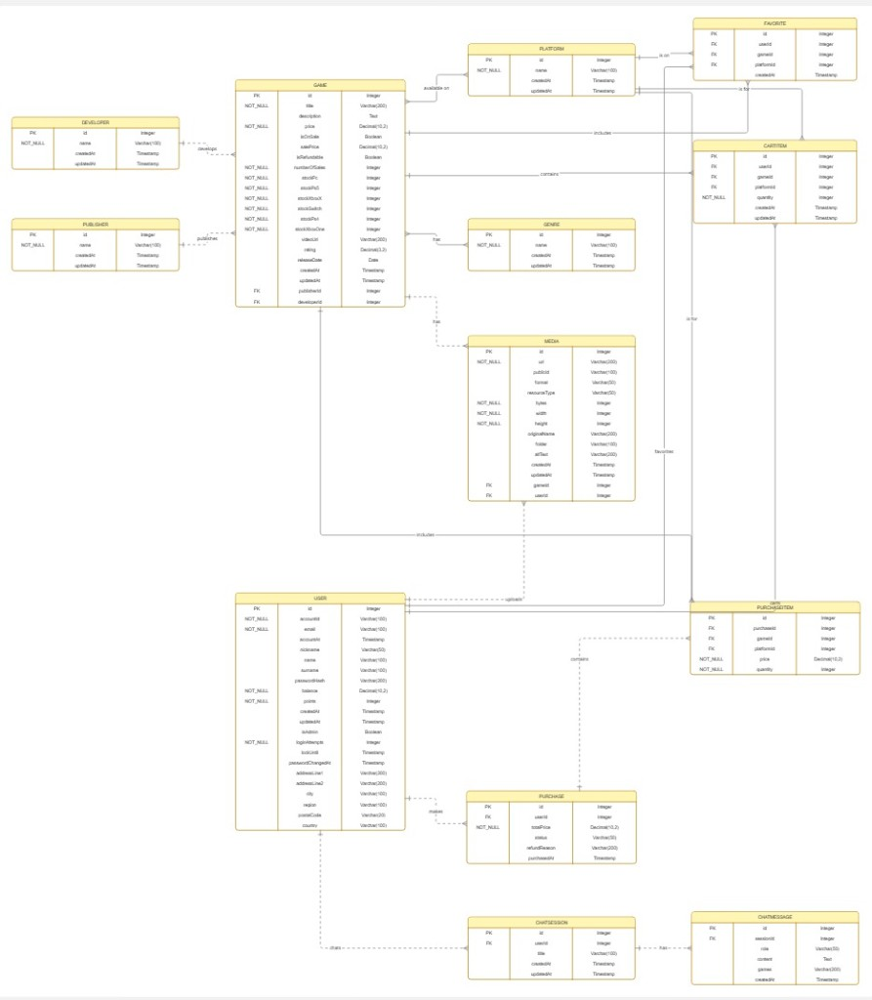

# 🎮 GameSage Android App

## 🛠️ Configuración inicial del Entorno (Android Studio)

Para evitar que el código y los comentarios en español, francés o alemán se marquen como faltas de ortografía (líneas verdes), se pueden añadir los paquetes de idiomas nativos del IDE:

1. Abre Android Studio y ve a **File > Settings** (o _Android Studio > Settings_ en macOS).
2. Ve a **Editor > Natural Languages**.
3. En la sección **Languages**, haz clic en el botón **`+`**.
4. Busca y añade los idiomas que necesites (Español, Français, Deutsch, Italian).
5. Haz clic en **Apply** y **OK**. Android Studio descargará los diccionarios automáticamente y dejará de marcar los textos.

## 🚀 Cómo ejecutar el proyecto

Para que el proyecto compile y los mapas funcionen correctamente, es obligatorio añadir la clave de la API de Google Maps a tu entorno local.

1. En la raíz de tu proyecto, abre (o crea si no existe) el archivo `local.properties`.
2. Añade la siguiente línea, sustituyendo el valor por tu clave real:

---

```properties
MAPS_API_KEY="TU_CLAVE_DE_API_AQUI"
```

o bien para que el build funcione y para pruebas (no funcionará el mapa):

```properties
MAPS_API_KEY="DEMO_KEY"
```

---

## 📚 Visión general de la app

GameSage Android es la versión móvil nativa del proyecto intermodular.  
La idea es: **una app de videojuegos "realista"**, que se conecta a un backend en producción (Angular SSR + API en Vercel) y que resume todo lo visto en el módulo de Android:

- Kotlin idiomático con corrutinas.
- Arquitectura con capas claras: **DataSource → Repository → ViewModel → UI (Compose)**.
- Navegación con **Jetpack Navigation Compose**.
- Persistencia local con **Room** para modo **offline first** (favoritos, carrito, chat…).
- **Hilt** para inyección de dependencias.
- **Flow/StateFlow** para observables.
- **CameraX + MediaStore** para cámara y galería.
- **WorkManager + Notifications** para tareas en segundo plano.
- **Soporte multi-idioma** (mínimo español/inglés).
- Y más

El objetivo del README es:

1. Explicar la estructura y lógica de la app.
2. Ir requisito por requisito del enunciado del proyecto y justificar cómo se cumple, con ejemplos reales.
3. Dejar una guía de referencia para cualquiera que abra el proyecto sin contexto.

---

## 🌐 Backend, API y base de datos (visión general rápida)

Aunque este README está centrado en la app Android, es importante entender muy por encima **de dónde salen los datos**:

- La app se conecta a una **API REST** desplegada dentro de un proyecto **Angular SSR** (Node.js + Express) en Vercel.
- Esa API utiliza **PostgreSQL** como base de datos, gestionada a través de **Prisma**.
- Toda la parte de servidor (modelos, migraciones, seguridad, scripts, etc.) está explicada con mucho más detalle en:
  - `El README base del repositorio` (raíz del repo, descripción general del proyecto GameSage).
  - `El README particular de la carpeta "angular-ssr"` (documentación larga y técnica del servidor SSR + API).

Desde el punto de vista de Android, lo importante es que:

- Existen endpoints como `/api/games`, `/api/favorites`, `/api/cart`, `/api/chat`, etc.
- Estos endpoints exponen **modelos de dominio compartidos** (Game, Favorite, CartItem, ChatSession, ChatMessage, User…).
- Los **repositorios Android** (por ejemplo `GameRepository`, `CartRepositoryImpl`, `ChatRepositoryImpl`) llaman a esos endpoints y convierten las respuestas a modelos Kotlin.

### Esquema ER (base de datos)

A nivel de modelo de datos, el backend define (simplificando) entidades como:

- `User`, `Game`, `Developer`, `Publisher`, `Genre`, `Platform`.
- Entidades de relación: `Favorite`, `CartItem`, `Purchase`, `PurchaseItem`.
- Entidades de chat: `ChatSession`, `ChatMessage`.
- Entidades de media: `Media` (imágenes, vídeos, avatares, etc.).

La idea general es:

- Un **User** puede tener:
  - Muchos **Favorite** (cada uno apunta a un `Game` + `Platform`).
  - Muchos **CartItem** (carrito).
  - Muchas **Purchase** (historial de compras).
  - Muchas **ChatSession** (conversaciones con la IA).
- Un **Game** puede estar en:
  - Muchos **Favorite** y **CartItem**.
  - Muchos **PurchaseItem**.
  - Muchas **Platform** y **Genre** (relaciones N:M).
  - Muchos registros de **Media** (portadas, capturas, vídeos).
- Una **ChatSession** tiene muchos **ChatMessage** asociados.

En el README de `angular-ssr` se detalla todo el esquema con Prisma y sus migraciones.



---

## 🧩 Estructura general del proyecto Android

A muy alto nivel, las piezas importantes dentro de `app/src/main/java/com/gamesage/kotlin` son:

- `MainActivity.kt`: punto de entrada de la app, configura tema, navegación y monitor de red.
- `di/GameSageApplication.kt`: clase `Application` con Hilt y configuración de WorkManager.
- `ui/navigation/NavGraph.kt`: toda la navegación con Navigation Compose.
- `ui/pages/...`: pantallas (Home, Product, Cart, Favorites, Chat, Contact, etc.) escritas en **Jetpack Compose**.
- `data/remote`: data sources que llaman a la API REST en Vercel.
- `data/local`: data sources locales (Room + DataStore/TokenManager).
- `data/repository`: capa de **repositorios**, que unen remoto y local.
- `data/model`: modelos de dominio que usa la app (Game, Favorite, CartItem, ChatMessage…).
- `data/worker`: workers de WorkManager, como `DailyGameWorker`.
- `utils`: utilidades como `LanguageUtils`, `NetworkMonitor`, `NotificationHelper`, etc.

El patrón que se repite casi en todos los módulos (juegos, carrito, favoritos, chat…) es:

```text
RemoteDataSource (API) ↔ Repository ↔ LocalDataSource (Room) ↔ ViewModel ↔ UI (Compose)
```

La UI nunca llama directamente a Retrofit/HttpClient ni a Room: siempre pasa por el repositorio o el ViewModel.

---

## ✅ Requisito: Lenguaje Kotlin idiomático

La app está escrita íntegramente en Kotlin:

- `data class` para modelos (`Game`, `CartItem`, `ChatMessage`, etc.).
- `sealed class` para estados de UI (`CartUiState`, `ChatUiState`…).
- Uso de **corutinas** (`viewModelScope.launch`) y `suspend` en repositorios/datasources.
- Uso de **flows** (`StateFlow`, `Flow<Result<...>>`).
- Extensiones (`fun CartItem.asCartItemUiState()`, conversores de entidades Room a modelo, etc.).

Ejemplo sencillo de uso idiomático de `data class` + extensión en el módulo de carrito:

```kotlin
data class CartItemUiState(
    val gameId: Int,
    val platformId: Int,
    val title: String,
    val imageUrl: String,
    val developerName: String?,
    val quantity: Int,
    val price: Double,
    val salePrice: Double?,
    val isOnSale: Boolean,
    val itemTotal: Double
)

fun CartItem.asCartItemUiState(): CartItemUiState {
    val game = this.game
    val unitPrice = if (game?.isOnSale == true && game.salePrice != null) {
        game.salePrice
    } else {
        game?.price ?: 0.0
    }
    return CartItemUiState(
        gameId = this.gameId,
        platformId = this.platformId,
        title = game?.title ?: "Unknown Game",
        imageUrl = game?.media?.firstOrNull()?.url ?: "https://...",
        developerName = game?.Developer?.name,
        quantity = this.quantity,
        price = game?.price ?: 0.0,
        salePrice = game?.salePrice,
        isOnSale = game?.isOnSale ?: false,
        itemTotal = unitPrice * this.quantity
    )
}
```

Ese patrón (modelo de dominio + modelo de UI + extensión) se repite en varios sitios.

---

## ✅ Requisito: Material 3 y diseño moderno

La app utiliza **Jetpack Compose** + **Material 3**:

- `Scaffold`, `TopAppBar`, `BottomBar`, `Button`, `OutlinedButton`, `Snackbar`, `TextField`…
- Paleta de colores oscura (`Color(0xFF111827)`, etc.).
- Componentes reutilizables (`TopBar`, `HomeBottomBar`, `OutlinedIconButton`, `CartHeader`, etc.).
- Temas de la aplicación personalizados y descargados en línea con herramientas de google.

Ejemplo en `CartScreen.kt`, donde se monta una pantalla típica con Material 3:

```kotlin
Scaffold(
    snackbarHost = { SnackbarHost(hostState = snackbarHostState) },
    containerColor = Color(0xFF111827)
) { paddingValues ->
    Box(
        modifier = Modifier
            .fillMaxSize()
            .background(Color(0xFF111827))
    ) {
        // ...
    }
}
```

La navegación principal (`NavGraph.kt`) también se apoya en un `Scaffold` con `TopBar` y `HomeBottomBar`.

---

## ✅ Requisito: Diferentes layouts y vistas

Se han utilizado distintos patrones de UI para cubrir el espíritu del requisito:

- Listas con `LazyColumn` (home, búsqueda, carrito, favoritos, chat).
- Contenedores `Row`, `Column`, `Box` para organizar el layout.
- Componentes de entrada de texto (`OutlinedTextField` en login, registro, chat…).
- Botones estándar y `OutlinedButton`, icon buttons (`IconButton`).
- Switches / campos booleanos y más controles en pantallas como configuración / dashboard.
- `CameraXViewfinder` como vista personalizada para la cámara.
- Entre otros

Por ejemplo, en el chat se usa un campo de texto con acciones de teclado:

```kotlin
OutlinedTextField(
    value = text,
    onValueChange = onTextChange,
    modifier = Modifier.weight(1f),
    placeholder = { Text(stringResource(R.string.aichat_input_hint), color = Color.Gray) },
    keyboardOptions = KeyboardOptions.Default.copy(
        imeAction = ImeAction.Send
    ),
    keyboardActions = KeyboardActions(
        onSend = {
            keyboardController?.hide()
            focusManager.clearFocus()
            onSend()
        }
    )
)
```

---

## ✅ Requisito: Internacionalización

La internacionalización está resuelta con:

- Ficheros `strings.xml` en español, inglés, alemán, francés e italiano.
- Una utilidad `LanguageUtils` que ajusta el `Context` al idioma elegido.
- Soporte a nivel de `Application` y `Activity` para que todo arranque con el locale correcto.
- Cambio de idioma en vivo desde la `TopBar` con un menu dropdown.

En `MainActivity.kt` se ve cómo se aplica el idioma guardado antes de pintar la UI:

```kotlin
override fun attachBaseContext(newBase: Context) {
    super.attachBaseContext(onAttach(newBase))
}

override fun onCreate(savedInstanceState: Bundle?) {
    installSplashScreen()
    super.onCreate(savedInstanceState)

    loadLocale(this)
    enableEdgeToEdge()
    // ...
}
```

Y en la `TopBar` se ofrece un selector de idioma:

```kotlin
onLanguageClick = { langCode ->
    setLocale(context, langCode)
    (context as? Activity)?.recreate()
}
```

De este modo, la app cumple el requisito de tener al menos dos idiomas, respetando el idioma elegido incluso en notificaciones (`DailyGameWorker` aplica `LanguageUtils.onAttach` antes de construir los textos).

---

## ✅ Requisito: Arquitectura (Repositorio, ViewModel, Hilt)

### Patrón repositorio

Hay repositorios para toda la app:

- `GameRepository`, `FavoritesRepository`, `CartRepository`, `ChatRepository`, `UserRepository`, etc.

Ejemplo en `ChatRepositoryImpl.kt`:

```kotlin
// Implementación del repositorio de chat: remoto primero, fallback a local.
class ChatRepositoryImpl @Inject constructor(
    @RemoteDataSource private val remoteDataSource: ChatDataSource,
    private val localDataSource: ChatLocalDataSource,
    @Suppress("unused") private val scope: CoroutineScope
) : ChatRepository {

    // Obtiene la lista de sesiones (remoto primero; si falla, devuelve las locales si hay).
    override suspend fun getSessions(): Result<List<ChatSession>> {
        return try {
            val remoteSessions = remoteDataSource.getSessions()
            val domainSessions = remoteSessions.map { it.toModel() }
            localDataSource.saveSessions(domainSessions)
            Result.success(domainSessions)
        } catch (e: Exception) {
            val localResult = localDataSource.getSessions()
            // ...
        }
    }
}
```

El patrón se repite en carrito, favoritos, etc.: el `Repository` decide de dónde salen los datos (remoto, local, mezcla de ambos) y expone un contrato simple a la UI.

### ViewModels

Cada pantalla de lógica tiene su ViewModel (salvo excepciones):

- `HomeScreenViewModel`, `SearchViewModel`, `ProductScreenViewModel`, `CartScreenViewModel`, `FavoritesViewModel`, `ChatViewModel`, `DashboardScreenViewModel`, `LoginScreenViewModel`, `RegisterScreenViewModel`, etc.

Ejemplo de `CartScreenViewModel`:

```kotlin
@HiltViewModel
class CartScreenViewModel @Inject constructor(
    private val cartRepository: CartRepository,
    private val loadingManager: com.gamesage.kotlin.utils.LoadingManager,
    @ApplicationContext private val context: Context
) : ViewModel() {
    private val _uiState = MutableStateFlow<CartUiState>(CartUiState.Initial)
    val uiState: StateFlow<CartUiState> = _uiState.asStateFlow()
    // ...
}
```

Las pantallas observan estos `StateFlow` con `collectAsState()` y pintan según el estado (Initial, Loading, Success, Error), siguiendo el flujo estudiado en clase.

### Inyección con Hilt

La app usa Hilt en toda la capa de datos y en los ViewModels/composables:

- `@HiltAndroidApp` en `GameSageApplication`.
- `@AndroidEntryPoint` en `MainActivity`.
- `@HiltViewModel` en los ViewModels.
- `@HiltWorker` en `DailyGameWorker`.
- `hiltViewModel()` para obtener instancias dentro de Compose.

Ejemplo en `GameSageApplication.kt`:

```kotlin
@HiltAndroidApp
class GameSageApplication: Application(), Configuration.Provider {

    @Inject lateinit var workerFactory: HiltWorkerFactory

    override val workManagerConfiguration: Configuration get() =
        Configuration.Builder()
            .setWorkerFactory(workerFactory)
            .build()
}
```

---

## ✅ Requisito: Observables (Flow / StateFlow / SharedFlow)

La app está construida sobre `Flow` y derivados:

- `StateFlow` para estado de UI (`uiState` en casi todos los ViewModels).
- `Flow<Result<List<...>>>` en observables de Room (`observeMessages`, `observe` de carrito, etc.).
- `Flow<Boolean>` en `NetworkMonitor.isOnline`.

Ejemplo en `MainActivity.kt`, usando un `Flow<Boolean>` para el estado de red:

```kotlin
val initialState = remember { networkMonitor.isOnlineStatus() }
val isOnline by networkMonitor.isOnline.collectAsState(initial = initialState)
```

Y en el chat:

```kotlin
private val _uiState = MutableStateFlow<ChatUiState>(ChatUiState.Initial)
val uiState: StateFlow<ChatUiState> = _uiState.asStateFlow()
```

---

## ✅ Requisito: Cámara y galería (CameraX + MediaStore)

El proyecto implementa una pantalla de cámara funcional usando **CameraX** y guardando fotos en la galería del dispositivo:

- `CameraScreen.kt`: gestiona permisos de cámara con `accompanist-permissions` y pinta la vista previa (`CameraXViewfinder`).
- `CameraViewModel.kt`: maneja la lógica de CameraX (bind/unbind, selector frontal/trasera, captura).
- Integración con `MediaStore` para guardar la foto en `Pictures/GameSage`.

Fragmento de `CameraScreen` donde se solicitan permisos:

```kotlin
val cameraPermissionState = rememberPermissionState(
    Manifest.permission.CAMERA
)

if (cameraPermissionState.status.isGranted) {
    CameraPreview(...)
} else {
    LaunchedEffect(Unit) {
        cameraPermissionState.launchPermissionRequest()
    }
}
```

Y en `CameraViewModel.takePhoto`, se usa `ImageCapture` y `MediaStore`:

```kotlin
val contentValues = ContentValues().apply {
    put(DISPLAY_NAME, "GameSage_${System.currentTimeMillis()}.jpg")
    put(MIME_TYPE, "image/jpeg")
    if (SDK_INT > Build.VERSION_CODES.P) {
        put(RELATIVE_PATH, "$DIRECTORY_PICTURES/GameSage")
    }
}
val uri = context.contentResolver.insert(EXTERNAL_CONTENT_URI, contentValues)
// Copia de bytes desde un archivo temporal a la galería
```

Con esto se cubre tanto el **acceso a la cámara** como el **acceso a la galería** mediante `MediaStore`.

---

## ✅ Requisito: Permisos en tiempo de ejecución

La app solicita permisos en tiempo de ejecución en varios puntos:

- Permiso de **cámara** en `CameraScreen`.
- Permiso de **notificaciones** (`POST_NOTIFICATIONS`) en `NavGraph`, para poder mostrar notificaciones en Android 13+.

Ejemplo de permisos de notificaciones:

```kotlin
if (Build.VERSION.SDK_INT >= Build.VERSION_CODES.TIRAMISU) {
    val notificationPermissionState = rememberPermissionState(POST_NOTIFICATIONS)
    if (!notificationPermissionState.status.isGranted) {
        LaunchedEffect(Unit) {
            notificationPermissionState.launchPermissionRequest()
        }
    }
}
```

Esto cumple el requisito de **comprobación y solicitud de permisos de tiempo de ejecución**.

---

## ✅ Requisito: Jetpack Navigation Component

La navegación está montada con **Navigation Compose**:

- `NavGraph.kt` define las rutas como `composable<Destinations.Home> { ... }`.
- Se usan argumentos tipados mediante `toRoute<Destinations.Product>()`.
- Se soporta back stack, navegación condicional según sesión (dashboard vs login), etc.

Ejemplo de ruta tipada:

```kotlin
composable<Destinations.Product> { backStackEntry ->
    val product = backStackEntry.toRoute<Destinations.Product>()
    ProductScreen(
        gameId = product.gameId,
        onNavigateToLogin = { navController.navigate(Destinations.Login) },
        onNavigateToCart = { navController.navigate(Destinations.Cart) }
    )
}
```

También se gestiona un **BottomBar** global, un menú tipo bottom sheet (`Menu`) y efectos de degradado en la parte superior/inferior, todo integrado con la navegación.

---

## ✅ Requisito: WorkManager y Notificaciones

La app utiliza **WorkManager** junto con **Hilt** y el sistema de notificaciones de Android para recomendar un juego diario (en el momento de entrega, por motivos de prueba, cada vez que arranca la app):

- `DailyGameWorker.kt`: worker que elige un juego (priorizando los que están en oferta) y lanza una notificación.
- `GameSageApplication.kt`: registra el `HiltWorkerFactory` y programa un trabajo (por ahora, `OneTimeWorkRequest` de prueba).
- `NotificationHelper`: crea el canal y muestra la notificación con **deep link** al juego (se pasa el `gameId` en el `Intent`).

Resumen de la lógica del worker:

```kotlin
@HiltWorker
class DailyGameWorker @AssistedInject constructor(
    @Assisted appContext: Context,
    @Assisted workerParams: WorkerParameters,
    private val gameRepository: GameRepository
) : CoroutineWorker(appContext, workerParams) {

    override suspend fun doWork(): Result {
        return try {
            val result = gameRepository.readAll()
            if (result.isSuccess) {
                val allGames = result.getOrNull() ?: emptyList()
                val gamesOnSale = allGames.filter { it.isOnSale }
                val gameToNotify = if (gamesOnSale.isNotEmpty()) gamesOnSale.random() else allGames.randomOrNull()
                // Construye textos localizados y lanza NotificationHelper.showNotification(...)
            }
            Result.success()
        } catch (_: Exception) {
            Result.retry()
        }
    }
}
```

En `GameSageApplication.onCreate` se programa la tarea:

```kotlin
val testWorkRequest = OneTimeWorkRequestBuilder<DailyGameWorker>().build()
WorkManager.getInstance(this).enqueue(testWorkRequest)
```

En producción se podría activar la versión periódica comentada con `PeriodicWorkRequest`.

---

## ✅ Requisito: Login / Logout y acceso a datos remotos

Aquí se ha optado por un **backend propio**, con políticas de seguridad bastante desarrolladas:

- Login/registro en pantallas `LoginScreen` y `RegisterScreen`.
- `TokenManager` que guarda el token de acceso y la preferencia de “recordarme”.
- `UserRepository` y `UserRemoteDataSource` para llamar a la API del backend.
- El resto de módulos (juegos, carrito, favoritos, chat) consumen la API REST de Vercel.

En `MainActivity`, antes de lanzar la UI, se comprueba el token:

```kotlin
runBlocking {
    val token = tokenManager.token.firstOrNull()
    val rememberMe = tokenManager.rememberMe.firstOrNull() ?: false
    if (token != null && !rememberMe) {
        tokenManager.deleteToken()
    }
}
```

El token controla, por ejemplo, si al pulsar en el icono de perfil se navega al `Dashboard` o a la pantalla de login:

```kotlin
onProfileClick = {
    if (token != null) {
        navController.navigate(Destinations.Dashboard) { ... }
    } else {
        navController.navigate(Destinations.Login)
    }
}
```

---

## ✅ Requisito: Animaciones y elementos multimedia

La app incluye, entre otras cosas:

- Animaciones en el historial del chat (`AnimatedVisibility` con `slideInVertically` / `fadeIn`) y de filtros en pantalla de búsqueda.
- Pequeñas animaciones de gradientes en listas (degradado que aparece/desaparece según el scroll).
- Uso de **imágenes** en prácticamente todas las pantallas (portadas de juegos con Coil, iconos de Material, etc.).
- Soporte para mostrar vídeos/imágenes provenientes del backend (via `Game.media`).

Fragmento de animación en el menú de historial de chat:

```kotlin
AnimatedVisibility(
    visible = showHistory,
    enter = slideInVertically(
        initialOffsetY = { it },
        animationSpec = tween(durationMillis = 300)
    ) + fadeIn(animationSpec = tween(durationMillis = 300)),
    exit = slideOutVertically(
        targetOffsetY = { it },
        animationSpec = tween(durationMillis = 300)
    ) + fadeOut(animationSpec = tween(durationMillis = 300))
) {
    // Contenido del historial
}
```

---

## ✅ Requisito: Preferencias locales (DataStore)

El patrón de preferencias locales se ve claro en:

- `TokenManager` (gestiona el token de usuario y el “remember me”).
- `LanguageUtils` / almacenamiento del idioma elegido.

Estas preferencias permiten:

- Recordar sesión entre aperturas de app (si el usuario marcó “recordarme”).
- Mantener el idioma aunque se cierre totalmente la app.

---

## ✅ Requisito: Persistencia local y uso de Room (Offline First)

Aquí es donde más se ha trabajado a propósito, para justificar claramente el uso de Room:

### ¿Por qué Room y no solo API?

- Se quiere que la app sea **usable aunque la conexión falle**.
- Algunos datos cambian poco y son perfectos para cache local (carrito, favoritos).
- El chat también puede almacenar historial local.

La estructura típica es:

- Entidades Room (`CartEntity`, `FavoriteEntity`, `ChatSessionEntity`, `ChatMessageEntity`…).
- DAO (`CartDao`, `FavoritesDao`, `ChatDao`).
- LocalDataSource que envuelve al DAO.
- Repository que decide si usar remoto, local, o ambos.

### Ejemplo 1: Carrito (Cart + Room)

En `data/local/cart` hay un `CartDao` y un `CartLocalDataSource`:

```kotlin
@Dao
interface CartDao {
    @Insert(onConflict = OnConflictStrategy.REPLACE)
    suspend fun insertItem(item: CartEntity)

    @Insert(onConflict = OnConflictStrategy.REPLACE)
    suspend fun insertItems(items: List<CartEntity>)

    @Query("SELECT * FROM cart")
    fun observeAll(): Flow<List<CartEntity>>

    @Query("DELETE FROM cart")
    suspend fun clear()
}
```

Y el repositorio mezcla datos remotos y locales:

```kotlin
class CartRepositoryImpl @Inject constructor(
    private val remoteDataSource: CartDataSource,
    private val localDataSource: CartLocalDataSource
) : CartRepository {

    override fun observe(): Flow<Result<List<CartItem>>> {
        return localDataSource.observe()
    }

    override suspend fun sync(): Result<List<CartItem>> {
        val remote = remoteDataSource.readAll()
        if (remote.isSuccess) {
            localDataSource.replaceAll(remote.getOrNull().orEmpty())
        }
        return remote
    }
}
```

La UI (`CartScreenViewModel`) observa el Flow de la base de datos local (Room), pero el repositorio se encarga de sincronizar con el servidor. Esto es justo el enfoque **offline first**: la pantalla muestra siempre lo que hay en local y, cuando la red responda, se refresca.

### Ejemplo 2: Favoritos

Los favoritos siguen la misma filosofía:

- `FavoritesLocalDataSource` con Room.
- `FavoritesRemoteDataSource` que llama a la API.
- `FavoritesRepositoryImpl` que se encarga de guardar localmente y exponer un `Flow` a la UI.

### Ejemplo 3: Chat

La parte de chat también tiene su propia mini arquitectura local:

- `ChatSessionEntity` y `ChatMessageEntity` como entidades Room.
- `ChatDao` con métodos para sesiones y mensajes.
- `ChatLocalDataSource` con métodos tipo:

```kotlin
suspend fun getSession(id: Int): Result<ChatSession> {
    val sessionEntity = chatDao.getSessionById(id)
        ?: return Result.failure(ChatNotFoundException())
    val messages = chatDao.getMessagesForSession(id).toModel()
    return Result.success(sessionEntity.toModel(messages))
}
```

- `ChatRepositoryImpl` que hace **remoto primero, fallback a local** si falla la red.

Esto permite, por ejemplo, que si hay un corte de conexión pero ya se ha guardado el historial en local, al menos la app pueda seguir mostrando conversaciones anteriores.

En resumen, Room se ha usado explícitamente para:

1. Mantener estado de carrito y favoritos sin depender siempre de la red.
2. Hacer caché local de información de chat.
3. Demostrar el patrón **offline first** que se pedía en la rúbrica correctamente.

### Qué funciona y qué no sin conexión

Gracias a Room y a los caches locales, **la app es navegable sin conexión**: puedes entrar a la mayoría de pantallas, ver listados de juegos ya cargados, abrir pantallas estáticas (condiciones, cookies, contacto, etc.) y revisar información que ya estaba guardada en local (por ejemplo ciertos historiales).

Sin embargo, todas las operaciones que dependen del servidor **no funcionarán mientras no haya red**, aunque la app siga respondiendo:

- Añadir o quitar productos del **carrito**.
- Marcar o desmarcar **favoritos**.
- Crear nuevas **compras** o finalizar el checkout.
- Actualizar datos de **perfil** o cualquier ajuste que se guarda en backend.
- Enviar mensajes al **chat con IA** (aunque el historial local pueda seguir mostrándose).

En estos casos, la app intenta siempre:

1. No romper la navegación (no crashea ni se queda en blanco).
2. Mostrar un mensaje claro de error o pérdida de conexión para que el usuario sepa qué ha pasado y por qué la acción no se ha aplicado.

---

## 🧠 Algunos elementos internos más avanzados

Además de los puntos que pide la rúbrica, la app tiene varias piezas un poco más avanzadas. Aquí se explican para entender qué problema resuelven.

### `NetworkMonitor`: monitor de conectividad reactivo

Archivo: `app/src/main/java/com/gamesage/kotlin/utils/NetworkMonitor.kt`

Este helper se encarga de **emitir cambios de conectividad** de forma reactiva usando un `Flow<Boolean>`:

- Usa `ConnectivityManager` + `NetworkCallback` para escuchar:
  - Redes que se conectan (`onAvailable`).
  - Redes que se pierden (`onLost`).
  - Cambios en capacidades (`onCapabilitiesChanged`), por ejemplo wifi conectada pero sin internet real.
- Cada vez que pasa algo, llama a `isOnlineStatus()` para comprobar si realmente hay una red con capacidad de internet (`NET_CAPABILITY_INTERNET`).
- Expone un `Flow<Boolean>` llamado `isOnline`:

```kotlin
val isOnline: Flow<Boolean> = callbackFlow {
    val callback = object : ConnectivityManager.NetworkCallback() {
        override fun onAvailable(network: Network) {
            trySend(isOnlineStatus())
        }

        override fun onLost(network: Network) {
            // Comprueba si queda otra red activa antes de emitir desconexión
            trySend(isOnlineStatus())
        }

        override fun onCapabilitiesChanged(network: Network, networkCapabilities: NetworkCapabilities) {
            // Detecta casos como wifi conectado pero sin acceso a internet
            trySend(isOnlineStatus())
        }
    }
    // ...
}.distinctUntilChanged()
```

En `MainActivity` se recoge ese `Flow` con `collectAsState` y se muestran **Snackbars globales** cada vez que se pierde o recupera conexión. Es una forma de centralizar la lógica de red sin tener que estar preguntando si hay internet en cada pantalla. Y especialmente, permite al usuario identificar al momento cuando perdió o recuperó la conexión, de forma que podrá ser consciente que porque quizás algunas funcionalidades no funcionen.

### Capa de carga global: `LoadingManager` + `GlobalLoadingViewModel`

En varias operaciones críticas (login, operaciones de carrito, llamadas que no deben cortarse en mitad de un cambio de pantalla) se usa un patrón de **carga global bloqueante**:

- `LoadingManager` expone un `StateFlow<Boolean>` (`isBlocking`) que indica si la app está “bloqueada”.
- `GlobalLoadingViewModel` lo inyecta y lo expone a la UI.
- En `NavGraph.kt` se observa ese estado:

```kotlin
val globalLoadingViewModel: GlobalLoadingViewModel = hiltViewModel()
val isGlobalBlocking by globalLoadingViewModel.loadingManager.isBlocking.collectAsState()
```

Si `isGlobalBlocking` es `true`, se pinta un overlay a pantalla completa:

```kotlin
if (isGlobalBlocking) {
    Box(
        modifier = Modifier
            .fillMaxSize()
            .zIndex(5000f)
            .background(Color.Black.copy(alpha = 0.6f))
            .pointerInput(Unit) {
                awaitEachGesture {
                    awaitFirstDown(pass = PointerEventPass.Initial)
                }
            },
        contentAlignment = Alignment.Center
    ) {
        CircularProgressIndicator(
            color = Color(0xFF22D3EE),
            modifier = Modifier.size(64.dp),
            strokeWidth = 6.dp
        )
    }
}
```

Ese `pointerInput` se queda con todos los toques, de forma que **ninguna pantalla debajo recibe eventos**. Esto evita bugs típicos de “el usuario se va a otra pantalla mientras se está guardando algo crítico”.

### Navegación profunda con notificaciones y Worker

La combinación de `DailyGameWorker`, `NotificationHelper` y `MainActivity` permite una navegación bastante cuidada:

- `DailyGameWorker` elige un juego y llama a `NotificationHelper.showNotification(...)`, pasándole el `gameId`.
- `NotificationHelper` crea una notificación cuyo `PendingIntent` lanza la `MainActivity` con un `extra` (`"gameId"`).
- En `MainActivity.onCreate`, antes de construir la UI, se lee ese extra:

```kotlin
var startDestination: Any = Destinations.Home
val gameIdFromNotification = intent.getLongExtra("gameId", -1L)
if (gameIdFromNotification != -1L) {
    startDestination = Destinations.Product(gameIdFromNotification)
}
```

De esta forma, si el usuario pulsa en la notificación, la app **abre directamente la ficha de ese juego**, aunque estuviera cerrada previamente.

### Chat con IA y fallback automático en Android

Aunque la lógica gorda del chat (IA, Google Generative AI, etc.) vive en el backend de Angular, la parte Android hace varias cosas interesantes:

- Gestiona sesiones e historial con `ChatRepositoryImpl` (remoto + Room).
- El ViewModel (`ChatViewModel`) mete el mensaje del usuario en la UI antes de recibir la respuesta (para que parezca instantáneo).
- Si el envío falla por problema de red (`IOException`), en vez de dejar la conversación “rota”, construye un **mensaje automático** usando un texto de error localizado:

```kotlin
result.onSuccess { assistantMessage ->
    // ...
}.onFailure { e ->
    if (e is java.io.IOException) {
        delay(1500)
        val autoReply = ChatMessage(
            id = null,
            sessionId = currentId ?: 0,
            role = "assistant",
            content = errorReplyText,
            createdAt = LocalDateTime.now(),
            games = null
        )
        _uiState.value = stateAfterSend.copy(
            messages = stateAfterSend.messages + autoReply,
            isSendingMessage = false
        )
    } else {
        _errorMessage.value = e.message ?: localizedContext.getString(R.string.error_generic)
        _uiState.value = stateAfterSend.copy(isSendingMessage = false)
    }
}
```

Así, el usuario recibe un mensaje “humano” explicando que no hay conexión, en vez de un fallo silencioso, que además debería tardar un poco en emitirse, de forma que parezca que está respondiendo el chat y no es un mensaje inmediato.

### `TokenManager` y la lógica de “recordarme”

`TokenManager` centraliza cómo se guarda el token JWT y si el usuario marcó o no la casilla de “recordarme”:

- Si hay token pero `rememberMe` es `false`, al reabrir la app se borra ese token (sesión temporal).
- Si `rememberMe` es `true`, la sesión se mantiene entre aperturas.

Esto se controla en `MainActivity` usando corrutinas bloqueantes al inicio:

```kotlin
runBlocking {
    val token = tokenManager.token.firstOrNull()
    val rememberMe = tokenManager.rememberMe.firstOrNull() ?: false
    if (token != null && !rememberMe) {
        tokenManager.deleteToken()
    }
}
```

---

## 🔚 Conclusión

GameSage Android es una app relativamente completa que:

- Usa **Kotlin idiomático** y corrutinas.
- Aplica arquitectura con **Repository + ViewModel + Hilt**.
- Usa **Navigation Compose**, **WorkManager**, **Notifications**, **CameraX**, **MediaStore**, **Room**, **Flows**…
- Está **internacionalizada** y conectada a un backend real desplegado en Vercel.

Este README intenta dejar por escrito **cómo** se han aplicado los requisitos del módulo, con ejemplos reales del código, y servir como guía para cualquier revisión o defensa del proyecto.
