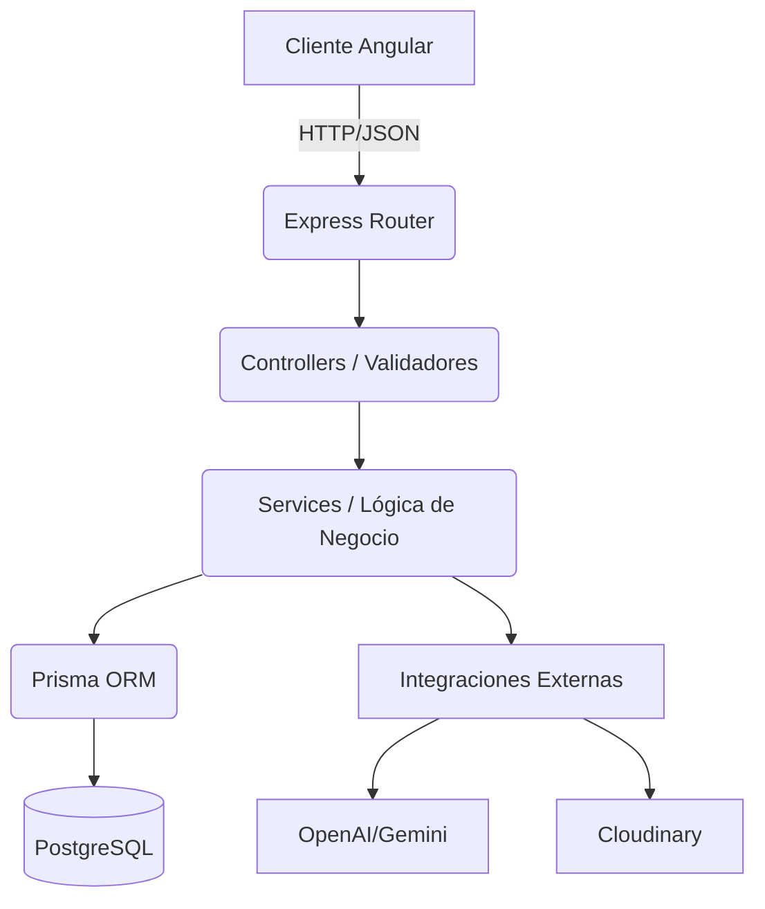

# DOCUMENTACIÓN TÉCNICA - VOLUMEN I: FUNDAMENTOS

**Proyecto: Plataforma de Videojuegos (Backend Node.js/Express)**

> **Nota**: Este documento corresponde a las **Secciones 1, 2 y 3** del Índice Maestro. Cubre la visión general, la configuración del entorno y la arquitectura base del servidor.

---

## 1. Visión General

### 1.1 Objetivos y Alcance

El objetivo principal de este proyecto es proveer una **API REST robusta, escalable y segura** para una plataforma de comercio electrónico de videojuegos. Esta API actúa como la "Fuente Única de Verdad" (Single Source of Truth) para todos los datos del sistema, gestionando desde el catálogo de productos hasta las transacciones financieras y la inteligencia artificial.

La plataforma se divide en tres pilares funcionales:

1.  **Tienda Pública (E-commerce)**: Permite a usuarios invitados y registrados explorar un catálogo, filtrar por múltiples criterios (género, precio, plataforma), gestionar un carrito de compras y realizar pedidos.
2.  **Panel de Administración (Backoffice)**: Provee endpoints protegidos para que los administradores gestionen el ciclo de vida de los productos (Juegos, Desarrolladores, Publishers) y visualicen métricas.
3.  **Asistente Virtual (IA)**: Un sistema de chat integrado que utiliza Modelos de Lenguaje (LLMs) para recomendar juegos basándose en el lenguaje natural del usuario y el inventario real de la base de datos.

### 1.2 Integración Frontend

Aunque este documento se centra en el Backend, es crucial entender que este servidor está diseñado para ser consumido por una **Single Page Application (SPA)** desarrollada en **Angular**.

- **Desacoplamiento**: El backend no sirve HTML (excepto la documentación Swagger). Todas las respuestas son estrictamente JSON.
- **Estado**: El servidor es _stateless_ (sin estado). La autenticación se maneja vía Tokens (JWT), lo que permite escalar horizontalmente si fuera necesario.
- **Contrato**: La comunicación se rige por la especificación OpenAPI (Swagger) expuesta en `/api-docs`.

### 1.3 Arquitectura del Sistema

El sistema sigue una arquitectura en capas clásica, optimizada para mantenimiento y testabilidad:



- **Router**: Enruta la petición a la sub-aplicación correcta (ej: `/api/games`).
- **Controller**: Desempaqueta la petición HTTP, valida los datos de entrada (DTOs) y llama al servicio.
- **Service**: Contiene la lógica pura de negocio "Agnóstica de HTTP". Aquí residen las reglas como "No se puede comprar sin stock".
- **Repository (Prisma)**: Abstracción de acceso a datos.

---

## 2. Entorno de Desarrollo y Configuración

### 2.1 Análisis de Dependencias (`package.json`)

El núcleo del proyecto se basa en un ecosistema de librerías cuidadosamente seleccionadas para garantizar seguridad, rendimiento y tipado estático. A continuación, se detalla el **POR QUÉ** de cada elección técnica crítica.

#### Dependencias de Producción (Runtime)

Estas librerías son esenciales para que la aplicación funcione en el servidor.

| Librería                            | Versión   | Propósito y Justificación                                                                                                                                                                                                                            |
| :---------------------------------- | :-------- | :--------------------------------------------------------------------------------------------------------------------------------------------------------------------------------------------------------------------------------------------------- |
| **`express`**                       | `^5.1.0`  | **El Framework Web.** Se ha optado por la versión 5 (actualmente en fase beta/estable reciente en algunos contextos) para aprovechar el manejo nativo de Promesas en los handlers, eliminando la necesidad de librerías como `express-async-errors`. |
| **`prisma`** & **`@prisma/client`** | `^6.18.0` | **ORM Moderno.** A diferencia de TypeORM o Sequelize, Prisma ofrece seguridad de tipos generada automáticamente a partir del esquema de BD. Esto reduce drásticamente los errores de runtime al acceder a propiedades inexistentes.                  |
| **`zod`**                           | `^3.24.1` | **Validación de Esquemas.** Se utiliza para validar tanto las variables de entorno como los `body` de las peticiones HTTP. Permite definir la estructura esperada de los datos y obtener tipos de TypeScript inferidos automáticamente.              |
| **`jsonwebtoken`**                  | `^9.0.2`  | **Autenticación Stateless.** Estándar de la industria para manejar sesiones sin guardar estado en el servidor. Permite firmar (sign) y verificar (verify) payloads JSON de forma segura.                                                             |
| **`bcrypt`**                        | `^6.0.0`  | **Seguridad de Contraseñas.** Implementa el algoritmo de hashing _bcrypt_, que es lento por diseño para resistir ataques de fuerza bruta. Es mandatorio para almacenar passwords de usuarios.                                                        |
| **`helmet`**                        | `^8.1.0`  | **Seguridad HTTP.** Middleware que configura automáticamente cabeceras HTTP de seguridad (como `X-Content-Type-Options`, `Strict-Transport-Security`). Es la primera línea de defensa contra vulnerabilidades web comunes.                           |
| **`cors`**                          | `^2.8.5`  | **Cross-Origin Resource Sharing.** Necesario porque nuestro Frontend (Angular) suele correr en un puerto/dominio distinto al Backend durante el desarrollo. Permite controlar qué dominios pueden consumir la API.                                   |
| **`winston`**                       | `^3.18.3` | **Logging Profesional.** A diferencia de `console.log`, Winston permite niveles de log (INFO, WARN, ERROR), formatos estructurados (JSON para producción) y múltiples transportes (archivo, consola, servicios externos).                            |
| **`express-rate-limit`**            | `^8.2.1`  | **Protección DDoS.** Limita el número de peticiones que una misma IP puede hacer en una ventana de tiempo. Crítico para proteger endpoints sensibles como `/api/auth/login`.                                                                         |
| **`multer`**                        | `^2.0.2`  | **Carga de Archivos.** Middleware para manejar `multipart/form-data`. Es esencial para permitir a los usuarios subir imágenes de perfil o portadas de juegos.                                                                                        |
| **`cloudinary`**                    | `^2.8.0`  | **Gestión de Assets.** SDK para interactuar con el servicio Cloudinary, donde se alojan las imágenes para optimizar el ancho de banda del servidor propio.                                                                                           |
| **`ai`** & **`@ai-sdk/google`**     | `latest`  | **Integración IA.** SDKs modernos (Vercel AI SDK) para estandarizar la comunicación con LLMs como Gemini, facilitando el streaming y el uso de herramientas (Tool Calling).                                                                          |

#### Dependencias de Desarrollo (DevDependencies)

Herramientas que solo viven en la máquina del desarrollador o en el CI/CD.

- **`typescript`** (`^5.9.3`): El lenguaje base. Aporta tipado estático fuerte.
- **`tsx`** (`^4.20.6`): Ejecutor de TypeScript de alto rendimiento (basado en esbuild). Reemplaza a `ts-node` para ejecutar scripts y el servidor en desarrollo (`npm run dev`) de forma casi instantánea.
- **`nodemon`** (`^3.1.10`): Vigila cambios en los archivos `.ts` y reinicia el servidor automáticamente. Se usa en conjunto con `tsx`.
- **`jest`** & **`supertest`**: Suite de testing. `jest` es el runner y `supertest` permite simular peticiones HTTP reales a la aplicación Express sin levantar un puerto de red real.
- **`@types/*`**: Paquetes de definiciones de tipos para librerías que están escritas en JavaScript nativo (ej: `@types/express`, `@types/bcrypt`). Sin esto, TypeScript no podría autocompletar ni validar el uso de esas librerías.

### 2.2 Configuración del Entorno (`src/config`)

La aplicación sigue estrictamente la metodología **The Twelve-Factor App**, almacenando la configuración en el entorno.

El archivo `src/config/env.ts` es el **guardian de la configuración**. Su responsabilidad no es solo leer `process.env`, sino **VALIDAR** que todas las variables necesarias existan al arrancar la aplicación. Si falta una variable crítica, la aplicación **falla inmediatamente** (Fail Fast) en lugar de funcionar incorrectamente a medias.

A continuación, se documenta cada variable requerida:

#### Block 1: Configuración del Servidor

| Variable       | Descripción                                                  | Valor por Defecto / Ejemplo             |
| :------------- | :----------------------------------------------------------- | :-------------------------------------- |
| **`PORT`**     | Puerto donde escuchará el servidor Express.                  | `3000`                                  |
| **`NODE_ENV`** | Define el entorno de ejecución. Afecta al logging y swagger. | `development` \| `production` \| `test` |

#### Block 2: Base de Datos (Prisma)

| Variable                       | Descripción                                                                                                                               |
| :----------------------------- | :---------------------------------------------------------------------------------------------------------------------------------------- |
| **`POSTGRES_PRISMA_URL`**      | Connection String principal para PostgreSQL. Debe incluir usuario, contraseña, host y base de datos. Usada para el Pooling en producción. |
| **`POSTGRES_URL_NON_POOLING`** | Connection String directo. Necesaria para comandos de migración de Prisma que no soportan pgbouncer/pooling.                              |

#### Block 3: Seguridad (JWT & Hashing)

| Variable                 | Descripción                                                                                                                                               | Valor por Defecto / Ejemplo |
| :----------------------- | :-------------------------------------------------------------------------------------------------------------------------------------------------------- | :-------------------------- |
| **`JWT_SECRET`**         | La llave maestra privada para firmar los Tokens. **CRÍTICO:** Si se filtra, cualquiera puede falsificar identidad. Debe ser una cadena larga y aleatoria. |                             |
| **`BCRYPT_SALT_ROUNDS`** | Costo computacional del hashing. Cuanto más alto, más seguro pero más lento.                                                                              | `10` (Recomendado)          |

#### Block 4: Servicios Externos (Cloudinary & IA)

| Variable                           | Descripción                                      | Valor por Defecto / Ejemplo |
| :--------------------------------- | :----------------------------------------------- | :-------------------------- |
| **`CLOUDINARY_CLOUD_NAME`**        | Identificador del bucket de Cloudinary.          |                             |
| **`CLOUDINARY_API_KEY`**           | Llave pública de API.                            |                             |
| **`CLOUDINARY_API_SECRET`**        | Llave privada de API para firmar subidas.        |                             |
| **`GOOGLE_GENERATIVE_AI_API_KEY`** | Token de acceso para la API de Gemini Google AI. |                             |

#### Block 5: Lógica de Negocio

| Variable           | Descripción                                                                                                                                                                                         |
| :----------------- | :-------------------------------------------------------------------------------------------------------------------------------------------------------------------------------------------------- |
| **`ADMIN_EMAILS`** | Lista CSV (separada por comas) de emails que automáticamente tendrán permisos de **Administrador** (IsAdmin=true) y saltarán validaciones de guard. Ejemplo: `admin@gamesage.com,dev@gamesage.com`. |

> **Código de Referencia (`src/config/env.ts`)**:
>
> ```typescript
> const required = (v: string | undefined, k: string) => {
>   if (!v) throw new Error(`Falta variable de entorno: ${k}`);
>   return v;
> };
> // ... export const env = { ... }
> ```
>
> _Esta función simple `required` es la que garantiza el principio de Fail Fast._

---

## 3. Arquitectura del Código (`src`)

### 3.1 Estructura del Filesystem

El código fuente está organizado modularmente bajo `/src`.

- `/api`: (Actualmente vacía, reservada para versiones futuras o gateways).
- `/config`: Configuraciones estáticas (DB, Env, Swagger).
- `/middleware`: Interceptores de peticiones HTTP reutilizables.
- `/modules`: **El corazón del sistema**. Cada carpeta aquí representa un dominio funcional (ej: `auth`, `games`). Contiene todo lo necesario para ese dominio verticalmente (Controlador, Servicio, Rutas, Tests).
- `/utils`: Funciones puras y helpers (Logger, Serializers).
- `/scripts`: Tareas de mantenimiento (Seeding, Cleaning).

### 3.2 El Core de la Aplicación (`app.ts`)

El archivo `src/app.ts` es el **punto de entrada** de la lógica HTTP. Aquí se ensambla el pipeline de procesamiento de Express. Analicémoslo **línea a línea** para entender el flujo de una petición.

#### Fase 1: Importaciones y Creación

```typescript
import express from "express";
// ... imports de middlewares y rutas ...
const app = express();
app.set("trust proxy", 1); // Necesario para que RateLimiter funcione detrás de un Proxy (Vercel/Nginx)
```

#### Fase 2: Middleware Global (Se ejecutan en CADA petición)

El orden aquí es **crítico**. Express ejecuta los middleware secuencialmente.

1.  **Seguridad (`helmet`)**:

    ```typescript
    app.use(helmet({ contentSecurityPolicy: false }));
    ```

    Bloquea cabeceras peligrosas antes de procesar nada más.

2.  **CORS (`cors`)**:

    ```typescript
    app.use(cors());
    ```

    Habilita peticiones desde cualquier origen (por defecto) o configurado. Debe ir antes de las rutas para manejar los _Preflight OPTIONS request_.

3.  **Parsing de Body (`express.json`)**:

    ```typescript
    app.use(express.json({ limit: "10mb" }));
    ```

    Transforma el cuerpo (raw bytes) de la petición en un objeto JSON accesible en `req.body`. Se aumenta el límite a 10mb para permitir subidas de JSON grandes si fuera necesario (aunque las imágenes van por multipart).

4.  **Logging (`requestLogger`)**:

    ```typescript
    app.use(requestLogger);
    ```

    Registra "Entró una petición". (Ver detalle en 3.3).

5.  **Serialización (`responseSerializer`)**:

    ```typescript
    app.use(responseSerializer);
    ```

    Interceptor inteligente que envuelve el método `res.json`. (Ver detalle en 3.3).

6.  **Rate Limiting condicional**:
    ```typescript
    if (env.NODE_ENV === "production") {
      app.use(generalLimiter);
    }
    ```
    En producción, protegemos el servidor globalmente contra abusos. En desarrollo se desactiva para no molestar.

#### Fase 3: Rutas y Documentación

- **Health Check**: `app.get("/api/health")`. Endpoint ligero para Load Balancers.
- **Swagger**: `app.use("/api-docs", swaggerUi.serve, ...)`. Sirve la web de documentación interactiva.

#### Fase 4: Montaje de Módulos (Enrutamiento)

Aquí se delega el control a los routers específicos de cada módulo.

```typescript
// Rutas de Autenticación (con Rate Limit específico más estricto)
if (env.NODE_ENV !== "test") {
  app.use("/api/auth", authLimiter, authRoutes);
} else {
  app.use("/api/auth", authRoutes); // Sin limite en tests para no flakear
}

// Rutas de Negocio
app.use("/api/users", usersRoutes);
app.use("/api/games", gamesRoutes);
app.use("/api/cart", cartRoutes);
app.use("/api/chat", chatRoutes);
// ... resto de módulos ...
```

#### Fase 5: Manejo de Errores (Final de la cadena)

Si ninguna ruta coincide o si algún controlador lanza un error (`next(err)` o throw), este middleware captura el problema.

```typescript
app.use(errorHandler);
```

### 3.3 Middleware Personalizado (Deep Dive)

En `src/middleware/` residen las piezas clave de la "fontanería" del servidor.

#### `auth.ts` (Guardia de Entrada)

- **Función**: Valida el token JWT en la cabecera `Authorization: Bearer <token>`.
- **Lógica**:
  1.  Verifica que la cabecera exista y empiece por "Bearer".
  2.  Extrae el token.
  3.  Usa `jwt.verify(token, env.JWT_SECRET)` para decodificarlo.
  4.  Si es válido, inyecta `req.user` con `{ sub, email, isAdmin }`.
  5.  Si falla, devuelve `401 Unauthorized`.
- **Uso**: Se aplica solo en rutas protegidas.

#### `authorize.ts` (Control de Acceso / RBAC)

- **Función**: Asegura que el usuario tenga rol de Administrador.
- **Lógica**: Verifica `req.user.isAdmin` (del JWT) O si el email del usuario está en la lista blanca de `ADMIN_EMAILS`.
- **Dependencia**: Requiere que `auth` se haya ejecutado antes.

#### `validate.ts` (Validación de Esquema)

- **Función**: Middleware de orden superior (Higher Order Function) que acepta un esquema Zod.
- **Lógica**:
  ```typescript
  const parsed = schema.safeParse(req.body);
  if (!parsed.success) return res.status(400).json(...)
  ```
  Si la validación falla, devuelve `400 Bad Request` con el detalle exacto de qué campo falló. Si pasa, `req.body` se sobrescribe con los datos "limpios" y tipados.

#### `requestLogger.ts` (Observabilidad)

- **Función**: Mide el tiempo de respuesta y loguea el resultado.
- **Lógica**: Captura `Date.now()` al inicio. Se suscribe al evento `res.on("finish")` para calcular la duración cuando la respuesta ya se ha enviado. Luego usa `winston` para registrar el método, ruta, código de estado y duración.

#### `serialize.ts` (Sanitización)

- **Función**: Interceptor global para limpiar datos sensibles antes de enviarlos.
- **Lógica**: Sobrescribe (Monkey Patching) el método `res.json`.
  Cada vez que un controlador llama a `res.json(data)`, este middleware intercepta `data`, busca campos prohibidos como `password`, `passwordHash` o propiedades internas de los objetos, y los elimina recursivamente.
  - _Ventaja_: Evita tener que hacer `delete user.password` en cada controlador manualmente. Es una red de seguridad global.

#### `error.ts` (Catch-All)

- **Función**: Estandariza la respuesta de error JSON.
- **Lógica**: Recibe cualquier error lanzado. Loguea el stack trace con `logger.error` y responde al cliente con `{ message: err.message }` y el status code correspondiente (o 500 por defecto). Evita que el cliente se quede "colgado" si algo falla en el servidor.
